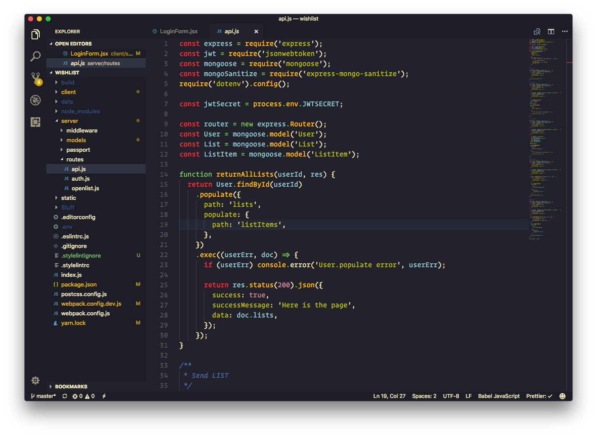
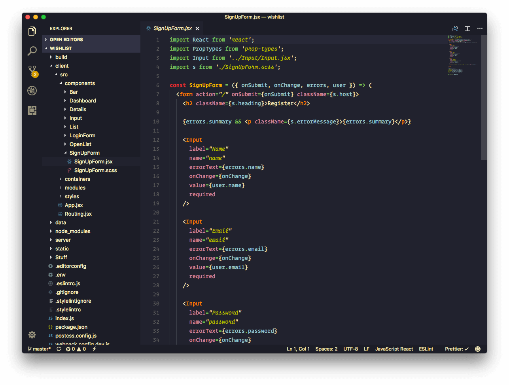
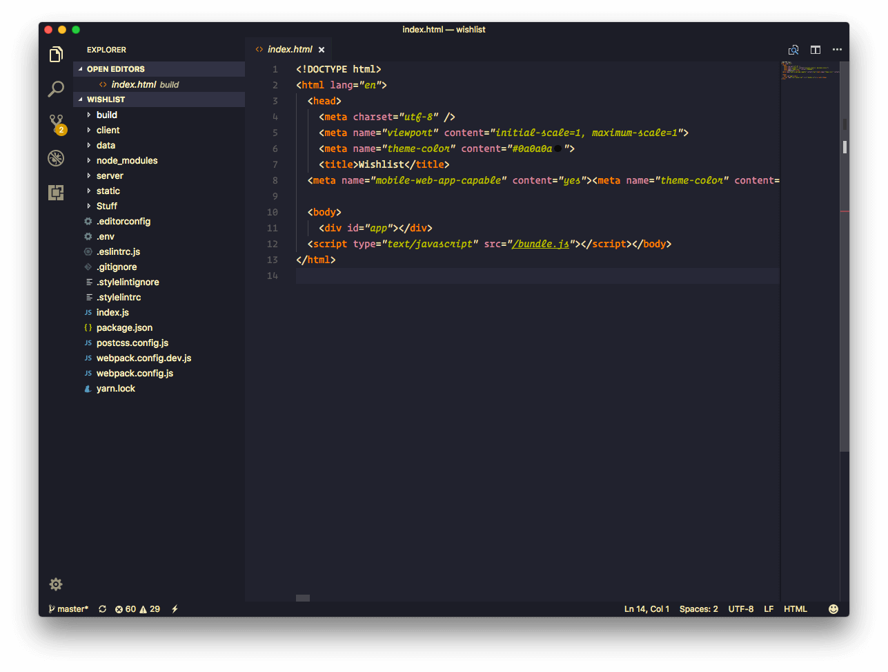
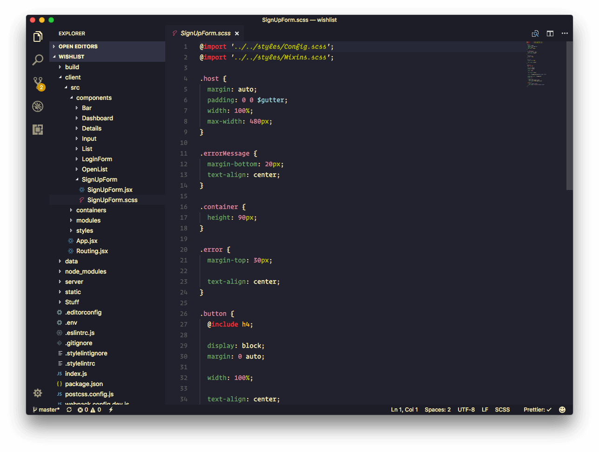
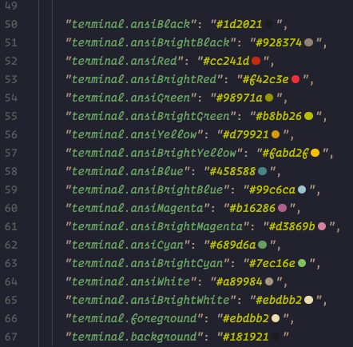

# README

## About
Based on defaut VS Dark+ color theme and with Gruvbox Dark. 

This might be only for web dev (HTML/CSS/JS) atm.

Other languages haven't been tested against, but PRs are welcomed.

## Tips
 - `tmTheme` is not being used since I think the default VS Dark+ works better for syntax highlighting & (seems to) require fewer configurations
 - In the `json` file, `scope` can be an `array` or a `string` of CSS classes
 - VSCode's dev tools (`Help > Toggle Developer Tools`) is very helpful to find
 out the scopes.
 - https://code.visualstudio.com/docs/getstarted/theme-color-reference

## Screenshots

### JS

### JSX

### HTML

### SCSS

### JSON

## Based on
- https://github.com/morhetz/gruvbox
- https://github.com/jdinhlife/vscode-theme-gruvbox
